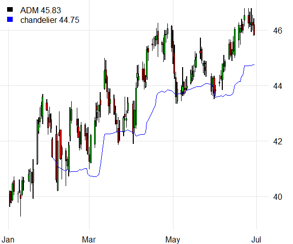

<!-- README.md is generated from README.Rmd. Please edit that file -->
Quantfunctions
==============

[](https://travis-ci.org/pverspeelt/Quantfunctions)

The goal of Quantfunctions is to extend quantmod or tidyquant with additional functions like protective stops and technical indicators not found in either of those packages nor in the TTR package. For example the protective stops can be used for technical trading rules or plotted on graphs like `chartSeries` from quantmod, `plot.xts` from xts, `geom_bar` from tidyquant, or `rtsplot` from rtsplot.

Installation
------------

You can install the development version of Quantfunctions from Github with:

``` r
library(remotes)
install_github("pverspeelt/Quantfunctions")
```

Chandelier Example
------------------

The following example shows how to add a chandelier stop to an `rtsplot` from the rtsplot package.

``` r
library(quantmod)
library(Quantfunctions)
library(rtsplot)
ADM <- getSymbols("ADM", from = "2018-01-01", to = "2018-07-01", auto.assign = FALSE)
ADM_chandelier <- chandelier(ADM)
rtsplot(ADM, type = "candle")
rtsplot.lines(ADM_chandelier, col = "blue")
rtsplot.legend(labels = c("ADM", 'chandelier'), 
               fill = c("black", "blue"), 
               list(ADM$ADM.Close, ADM_chandelier))
```



This readme was created on: 2019-02-15
